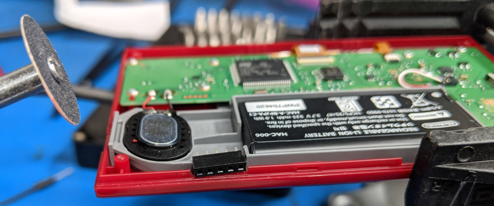
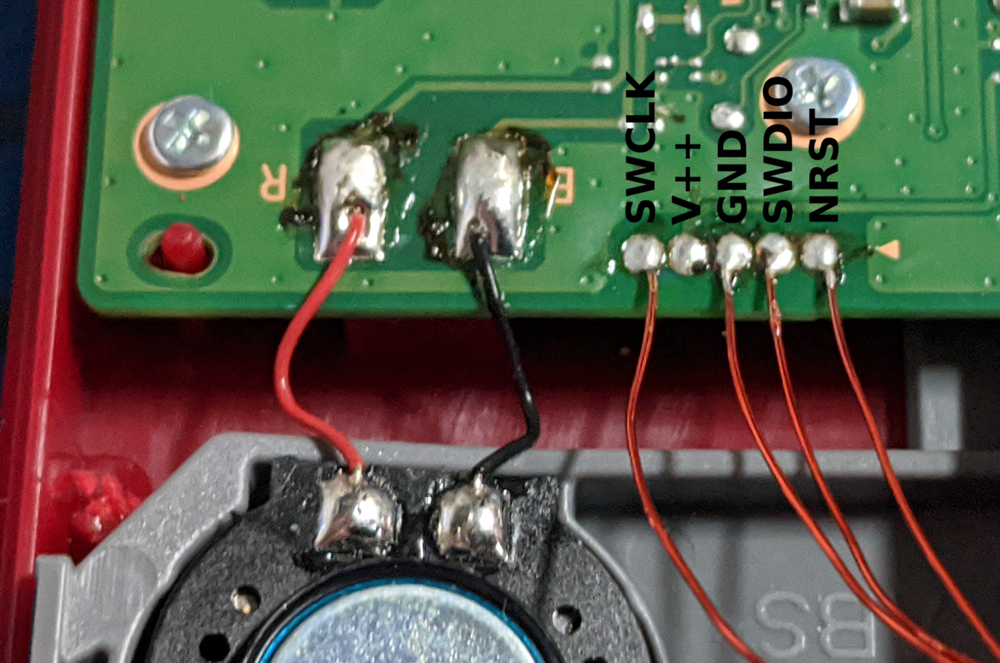
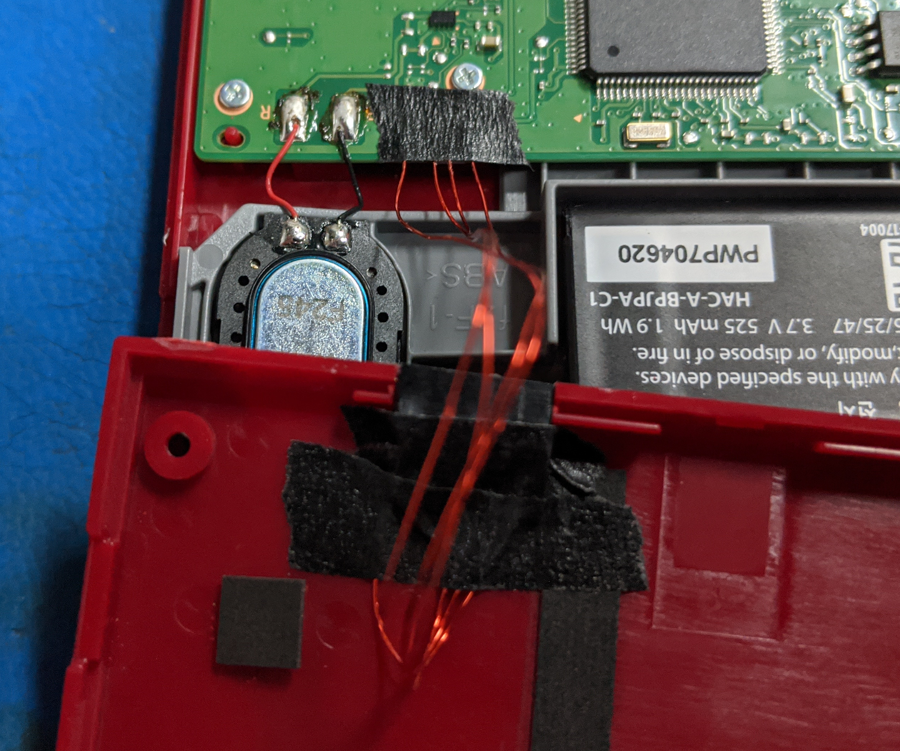
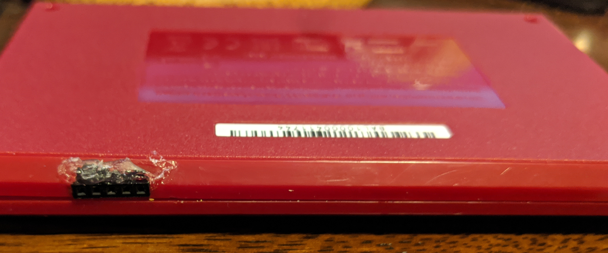

# Nintendo Game and Watch Investigations 

Since @ghidraninja pointed out that these devices use an STM32H7 chip with an exposed debugging port, I decided to try playing around with them.

Tl;dr: thank you, Nintendo! Thanks to its openness, this is about as exciting to me as the Switch was.

These devices do have readout protection level 1 enabled, but it looks like they probably execute code off of their external SPI Flash chip, so it shouldn't be too hard to back up the firmware for your personal use. Think of it as an extra puzzle game that they included for free.

I haven't figured out how to dump the device's stock firmware yet, but there is a `sspi_read` program which can be loaded into RAM to read out the contents of the external SPI Flash chip.

In the meantime, I've been poking at the stock firmware's registers to see how the pins are connected and how the peripherals are configured. Here's what I've found so far:

# Fitting a Debug Connector

This involves a little bit of fine soldering, but I think it's worthwhile to add a debug port if you're going to be reprogramming this board very often. From my perspective, it's one of the most attractively-priced STM32H7 development kits that I've ever seen. A display, battery, *and* case for $50? Nice.

Fortunately, there's a bit of room between the speaker and the battery for a small connector. I used a 2mm-pitch row of pins, but you could probably fit 0.1" headers, especially if you omit the `V++` positive voltage pin.



**BE SURE TO DISCONNECT THE BATTERY BEFORE SOLDERING ANYTHING!** The `V++` pin is right next to the `GND` one, and not shorting power lines together is a good rule of thumb. You can pluck the connector with red and white wires off of the board; it "clicks" in and out of the board's plastic connector from the top.

You can still power the device from the USB-C port while the battery is disconnected, so it's not a bad idea to leave it unplugged while you are debugging the device. That way, un-plugging the USB cable turns into an easy way to power-cycle the board.

You can probe the pins with a multimeter [like @ghidraninja did](https://www.youtube.com/watch?v=Rsi8p5gbaps), but since these mappings are public knowledge now:



Enameled "magnet wire" isn't a bad choice for these connections, because the holes are so small and it's easy to work with. (It's not magnetic, it's just usually used in winding transformers.)

Once you've soldered everything together, you can glue and/or tape everything in place:



The way I glued this together, the two halves of the case can't move too far apart. I think it works okay, but you might want to glue the connector to the other side of the housing if that would bother you. Once you've verified that you can open an OpenOCD connection using the connector, snap the case back together and clean up any loose edges:



# RAM Regions

You can dump a region of RAM from a GDB session:

    dump binary memory [output.bin] [start_address] [end_address]

The addresses are inclusive, so a range of `0x00000000` - `0x00000008` will dump the first 8 bytes of ITCM RAM.

It sounds like the stock firmware loads images from external SPI Flash into RAM, so it should be possible to locate modifiable executable regions by comparing the RAM banks to the SPI Flash image at various stages.

|   Region   | Start Address | End Address |  Size  |
|:----------:|:-------------:|:-----------:|:------:|
| Backup RAM | 0x38800000    | 0x38801000  | 4KiB   |
| SRD RAM    | 0x38000000    | 0x38008000  | 32KiB  |
| AHB SRAM2  | 0x30010000    | 0x30020000  | 64KiB  |
| AHB SRAM1  | 0x30000000    | 0x30010000  | 64KiB  |
| AXI SRAM3  | 0x240A0000    | 0x24100000  | 384KiB |
| AXI SRAM2  | 0x24040000    | 0x240A0000  | 384KiB |
| AXI SRAM1  | 0x24000000    | 0x24040000  | 256KiB |
| DTCM RAM   | 0x20000000    | 0x20020000  | 128KiB |
| ITCM RAM   | 0x00000000    | 0x00010000  | 64KiB  |

Example GDB commands to dump RAM banks:

```
(gdb) target extended-remote :3333
Remote debugging using :3333
warning: No executable has been specified and target does not support
determining executable automatically.  Try using the "file" command.
0xfffffffe in ?? ()
(gdb) dump binary memory time_bkp.bin  0x38800000 0x38801000
(gdb) dump binary memory time_srd.bin  0x38000000 0x38008000
(gdb) dump binary memory time_ahb2.bin 0x30010000 0x30020000
(gdb) dump binary memory time_ahb1.bin 0x30000000 0x30010000
(gdb) dump binary memory time_axi3.bin 0x240A0000 0x24100000
(gdb) dump binary memory time_axi2.bin 0x24040000 0x240A0000
(gdb) dump binary memory time_axi1.bin 0x24000000 0x24040000
(gdb) dump binary memory time_dtcm.bin 0x20000000 0x20020000
(gdb) dump binary memory time_itcm.bin 0x00000000 0x00010000
```

# Pin Mappings and Peripheral Configurations

```
GPIOx: 0x58020000 + ( 0x400 * x )
MODER: +0x00
OTYPER: +0x04
OSPEEDR: +0x08
PUPDR: +0x0C
ODR: +0x14
AFRL: +0x20
AFRH: +0x24

MODER = pin mode
0 = Floating input
1 = Output
2 = Alternate Function (Peripheral)
3 = Analog (ADC/DAC)

OTYPER = output type
0 = Push-Pull
1 = Open-Drain

OSPEEDR ~= "drive strength"
0 = Low
1 = Medium
2 = High
3 = Very High

PUPDR = pulling resistors
0 = None
1 = Pull-up
2 = Pull-down

AFRL/AFRH = alternate function mapping.

GPIOA:   0x58020000
MODER:   0xABAABFC8
OTYPER:  0x0000
OSPEEDR: 0x0C000008
PUPDR:   0x64000001
AFRL:    0xE0000090
AFRH:    0x0000ECEE
ODR:     0

GPIOB:   0x58020400
MODER:   0xA9AEABEA
OTYPER:  0x00C0
OSPEEDR: 0x000000F8
PUPDR:   0x00000100
AFRL:    0x44B009B9
AFRH:    0x5E50EE0E
ODR:     0x1000

GPIOC:   0x58020800
MODER:   0xF3EBA3F2
OTYPER:  0x0000
OSPEEDR: 0x00000000
PUPDR:   0x04000404
AFRL:    0xEE00000B
AFRH:    0x00000EA0
ODR:     0

GPIOD:   0x58020C00
MODER:   0x0E21E1A4
OTYPER:  0x0000
OSPEEDR: 0x02000000
PUPDR:   0x50440401
AFRL:    0x0E00E900
AFRH:    0x00090E00
ODR:     0x0110

GPIOE:   0x58021000
MODER:   0xBBBD2A6F
OTYPER:  0x0000
OSPEEDR: 0x00400020
PUPDR:   0x00004000
AFRL:    0x06660900
AFRH:    0xE0E0B000
ODR:     0x0008

GPIOF-GPIOK regs: 0xFFFFFFFF

OCTOSPI1:    0x52005000
CR: +0x00:   0x30400301
DCR1: +0x08: 0x01130108
DCR2: +0x0C: 0x00000001
DCR3: +0x10: 0x00000000
DCR4: +0x14: 0x00000000
CCR: +0x100: 0x83032301
TCR: +0x108: 0x00000004

OCTOSPIM:    0x5200B400
CR: +0x00:   0x00000000
P1CR: +0x04: 0x03010111
P2CR: +0x08: 0x07050333
```

# Tentative Pin Mapping Table

| Pin |    Mode    |   OType    | OSpeed |   PUPD    | Alt. Func. |
|:---:|:----------:|:----------:|:------:|:---------:|:----------:|
| A0  | Input      | N/A        | N/A    | Pull-Up   | Button/IRQ |
| A1  | Alt. Func. | Push-Pull  | High   | None      | OSPI\_IO3  |
| A2  | Input      | N/A        | N/A    | None      | ?          |
| A3  | Analog     | N/A        | N/A    | None      | -          |
| A4  | Analog     | N/A        | N/A    | None      | Backlight  |
| A5  | Analog     | N/A        | N/A    | None      | Backlight  |
| A6  | Analog     | N/A        | N/A    | None      | Backlight  |
| A7  | Alt. Func. | Push-Pull  | Low    | None      | LCD\_VSYNC |
| A8  | Alt. Func. | Push-Pull  | Low    | None      | LCD\_R6    |
| A9  | Alt. Func. | Push-Pull  | Low    | None      | LCD\_R5    |
| A10 | Alt. Func. | Push-Pull  | Low    | None      | LCD\_B4    |
| A11 | Alt. Func. | Push-Pull  | Low    | None      | LCD\_R4    |
| A12 | Analog     | N/A        | N/A    | None      | -          |
| A13 | Alt. Func. | Push-Pull  | V.High | Pull-Up   | SWDIO/JTMS |
| A14 | Alt. Func. | Push-Pull  | Low    | Pull-Down | SWCLK/JTCK |
| A15 | Alt. Func. | Push-Pull  | Low    | Pull-Up   | JTDI       |
| B0  | Alt. Func. | Push-Pull  | High   | None      | LCD\_R3    |
| B1  | Alt. Func. | Push-Pull  | V.High | None      | OSPI\_IO0  |
| B2  | Alt. Func. | Push-Pull  | V.High | None      | OSPI\_CLK  |
| B3  | Analog     | N/A        | N/A    | None      | -          |
| B4  | Analog     | N/A        | N/A    | Pull-Up   | NJTRST     |
| B5  | Alt. Func. | Push-Pull  | Low    | None      | LCD\_B5    |
| B6  | Alt. Func. | Open-Drain | Low    | None      | I2C1\_SCL  |
| B7  | Alt. Func. | Open-Drain | Low    | None      | I2C1\_SDA  |
| B8  | Alt. Func. | Push-Pull  | Low    | None      | LCD\_B6    |
| B9  | Analog     | N/A        | N/A    | None      | -          |
| B10 | Alt. Func. | Push-Pull  | Low    | None      | LCD\_G4    |
| B11 | Alt. Func. | Push-Pull  | Low    | None      | LCD\_G5    |
| B12 | Output     | Push-Pull  | Low    | None      | ?          |
| B13 | Alt. Func. | Push-Pull  | Low    | None      | SPI2\_SCK  |
| B14 | Alt. Func. | Push-Pull  | Low    | None      | LCD\_CLK   |
| B15 | Alt. Func. | Push-Pull  | Low    | None      | SPI2\_SDO  |
| C0  | Alt. Func. | Push-Pull  | Low    | None      | LCD\_G2    |
| C1  | Input      | N/A        | N/A    | Pull-Up   | Button/IRQ |
| C2  | Analog     | N/A        | N/A    | None      | -          |
| C3  | Analog     | N/A        | N/A    | None      | -          |
| C4  | Analog     | N/A        | N/A    | None      | -          |
| C5  | Input      | N/A        | N/A    | Pull-Up   | Button/IRQ |
| C6  | Alt. Func. | Push-Pull  | Low    | None      | LCD\_HSYNC |
| C7  | Alt. Func. | Push-Pull  | Low    | None      | LCD\_G6    |
| C8  | Analog     | N/A        | N/A    | None      | -          |
| C9  | Alt. Func. | Push-Pull  | Low    | None      | LCD\_G3    |
| C10 | Alt. Func. | Push-Pull  | Low    | None      | LCD\_R2    |
| C11 | Analog     | N/A        | N/A    | None      | -          |
| C12 | Analog     | N/A        | N/A    | None      | -          |
| C13 | Input      | N/A        | N/A    | Pull-Up   | Button/IRQ |
| C14 | Analog     | N/A        | N/A    | None      | -          |
| C15 | Analog     | N/A        | N/A    | None      | -          |
| D0  | Input      | N/A        | N/A    | Pull-Up   | Button/IRQ |
| D1  | Output     | Push-Pull  | Low    | None      | ?          |
| D2  | Alt. Func. | Push-Pull  | Low    | None      | LCD\_B7    |
| D3  | Alt. Func. | Push-Pull  | Low    | None      | LCD\_G7    |
| D4  | Output     | Push-Pull  | Low    | None      | ?          |
| D5  | Input      | N/A        | N/A    | Pull-Up   | Button/IRQ |
| D6  | Alt. Func. | Push-Pull  | Low    | None      | LCD\_B2    |
| D7  | Analog     | N/A        | N/A    | None      | -          |
| D8  | Output     | Push-Pull  | Low    | None      | ?          |
| D9  | Input      | N/A        | N/A    | Pull-Up   | Button/IRQ |
| D10 | Alt. Func. | Push-Pull  | Low    | None      | LCD\_B3    |
| D11 | Input      | N/A        | N/A    | Pull-Up   | Button/IRQ |
| D12 | Alt. Func. | Push-Pull  | High   | None      | OSPI\_IO1  |
| D13 | Analog     | N/A        | N/A    | None      | -          |
| D14 | Input      | N/A        | N/A    | Pull-Up   | Button/IRQ |
| D15 | Input      | N/A        | N/A    | Pull-Up   | Button/IRQ |
| E0  | Analog     | N/A        | N/A    | None      | -          |
| E1  | Analog     | N/A        | N/A    | None      | -          |
| E2  | Alt. Func. | Push-Pull  | High   | None      | OSPI\_IO2  |
| E3  | Output     | Push-Pull  | Low    | None      | ?          |
| E4  | Alt. Func. | Push-Pull  | Low    | None      | SAI1\_FS   |
| E5  | Alt. Func. | Push-Pull  | Low    | None      | SAI1\_SCK  |
| E6  | Alt. Func. | Push-Pull  | Low    | None      | SAI1\_SD   |
| E7  | Input      | N/A        | N/A    | Pull-Up   | Button/IRQ |
| E8  | Output     | Push-Pull  | Low    | None      | ?          |
| E9  | Analog     | N/A        | N/A    | None      | -          |
| E10 | Analog     | N/A        | N/A    | None      | -          |
| E11 | Alt. Func. | Push-Pull  | Medium | None      | OSPI\_NCS  |
| E12 | Analog     | N/A        | N/A    | None      | -          |
| E13 | Alt. Func. | Push-Pull  | Low    | None      | LCD\_DE    |
| E14 | Analog     | N/A        | N/A    | None      | -          |
| E15 | Alt. Func. | Push-Pull  | Low    | None      | LCD\_R7    |

Yay! The QSPI Flash chip is in memory-mapped mode! That should let us execute arbitrary code and get around the readout portection.

Flash size = `2^(DEVSIZE+1)` bytes = `2^(19+1)` = 1MiB. Pretty small, but it's something. [The chip appears to be an MX25U8035F](https://www.macronix.com/Lists/Datasheet/Attachments/7521/MX25U8035F,%201.8V,%208Mb,%20v1.1.pdf).

The LCD appears to be an Innolux model (`ZJ024NA-17A`), and if the similar `ZJ050NA-08C` is any indication, it uses a raw LCD interface with no command channel. If we're lucky, it might be as easy as sending a framebuffer over the LTDC peripheral. It is probably QVGA (240x320-px). Signals RGB[2:7] are used, so it probably supports up to 18 bits of color per pixel.

Pins `A4`, `A5`, and `A6` are connected to the gates of NPN transistors which connnect to the three backlight cathodes (I think, but they could be anodes). These pins are configured in "Analog" mode, so...I guess the stock firmware might use the DAC outputs instead of PWM to control brightness? That would be interesting.

I would also guess that the SAI peripheral is connected to an audio codec which drives the speaker, and the I2C1 peripheral might talk to the battery management chip to get the current battery level for the GUI.

# Unlocking the Internal Flash Memory

You can turn your Game and Watch into a general-purpose STM32H7B0VB development kit by unlocking the Flash memory. This will remove the read protection, but it will also **permanently erase the original Flash image**.

If you unlock your chip without finding a way to dump the internal memory first, you will never be able to use the device as intended again. (Well, not unless you find the original ROM image somewhere else.)

So I would not recommend doing this until you have a copy of the original program image. But it's easy to do. Open an OpenOCD connection:

    openocd -f jlink.cfg -c "transport select swd" -f stm32h7x_dual_bank.cfg

Or:

    openocd -f stlink.cfg -f stm32h7x_dual_bank.cfg

Then connect to the OpenOCD interface with `telnet localhost 4444` and run these commands:

```
reset halt
stm32h7x unlock 0
exit
```

Power-cycle the board, and you're good to go. But you'll need to write your own firmware to communicate with the various on-board devices, so it might be a good idea to keep one device on the stock firmware so you can probe various communications.
